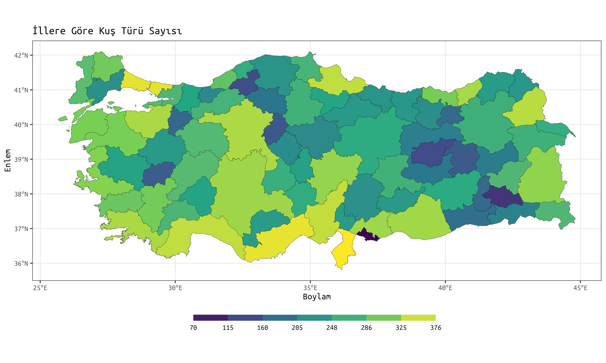

**Merhabalar, blogun ilk yazısına hoş geldiniz. Temel bilgiler içeren yazılar da olacak ancak blog içeriklerinin çoğunun bu gibi vaka örneklerinden oluşacağını düşünüyorum. Takıldığınız ve anlamadığınız yerler olursa lütfen yorum yapmaya çekinmeyiniz. Ayrıca katkılarınızı ve eleştirilerinizi de bekliyorum. Keyifli okumalar.**

Lisansa başladığım yıllarda arazi çalışmaları için can atan, lablardan ve her türlü veri işinden kaçan biriydim. Doğayı gözlemlemeyi; kuş ve memeli arazilerine gitmeyi çok seviyor, bu konularda yapacağım bilimsel çalışmaları düşlüyordum. Ancak korkunun ecele faydası yokmuş. Doğadaki gözlemlerimizden anlamlı bilgiler çıkartmanın yolu veriden geçiyormuş. 😅 Veriyi, münasebetimiz arttıkça sevmeye başladım. Ama öyle zorunluluktan sevmek falan değil. İçine girdikçe ne kadar haz veren bir uğraş olduğunu keşfettim. İstatistik ve veri analizi, rakamlardan ibaret değil, hayatın her yerinde. Onu sevelim, koruyalım. :) Neyse lafı fazla uzatmadan konuya döneyim.

Bu blog yazısında, R programlama dilini kullanarak kuş verilerinin nasıl işlendiğini göstereceğim. Yazının uzunluğu korkutmasın! Sadece azıcık bir ilgi ve temel R ile GIS bilgisi yeterli olacak. Kuşlara ilginiz olmasa bile, bu yazının bazı temel mekânsal analizleri öğrenmek için faydalı olacağını düşünüyorum. Takıldığınız her noktada çekinmeden yorum yapabilirsiniz.

Size iki ana soru sunuyorum:

1. Türkiye'deki iller bazında kuş türü çeşitliliği nasıl bir dağılıma sahip?
2. Bilindiği gibi Kızılcahamam, Türkiye'deki en önemli kara akbaba - *Aegypius monachus* popülasyonlarından birisini barındırıyor. Bu türün, Kızılcahamam ilçe sınırları içerisinde nasıl bir dağılımı vardır? Türün dağılımıyla çevresel faktörler arasındaki ilişki **kabaca** nasıldır?

Bu yazıda yalnızca birinci soruya odaklanacağız. İkinci soru için ikinci yazıyı bekleyiniz lütfen. :)

--------------------------------------------------------------------------------

### 1. GEREKLİ PAKETLERİN YÜKLENMESİ

```{r}
#| echo: false
tibble::tribble(
  ~ Paket, ~ Açıklama,
  "tidyverse", "Çoğunlukla veri manipülasyonu ve görselleştirme üzerine paketler içeren bir paket koleksiyonu",
  "sf", "Simple Features: Mekânsal vektör verileri işlemek için",
  "rgeoboundaries", "Mülki idare sınırlarını indirmek için"
) |> knitr::kable()
```

Eğer bu paketler kurulu değilse aşağıdaki kod bloğu ile kurabilirsiniz. Bu kod bloğu, paketi R'a yüklemeye çalışacak, eğer yükleyemezse kuracaktır. Eğer kurulumda sıkıntı yaşarsanız paketlerin dökümantasyonuna bakabilirsiniz.

```{r}
#| output: false
if (!require("tidyverse")) install.packages("tidyverse")
if (!require("sf")) install.packages("sf")
if (!require("rgeoboundaries")) install.packages("rgeoboundaries")
```

Eğer paketler kuruluysa, bu paketleri library() fonksiyonu ile yükleyebiliriz.

```{r}
#| warning: false
library(tidyverse) # bircok veri isini kolaylastirmak icin
library(sf) # r'da mekansal vektor verileri islemek icin
library(rgeoboundaries) # tr il sinirlarina erismek icin
```

### 2. KUŞ VERİSİNİN YÜKLENİP BU YAZI İÇİN GEREKLİ OLAN ALT KÜMESİNİN ALINMASI

Yazımızdaki ilk soruya cevap verebilmek için iki temel veriye ihtiyacımız var. Bunlar **kuş** ve **Türkiye'nin il sınırları** verileri.

Kuş verisini [eBird](https://ebird.org) veri tabanından alacağız. eBird, Türkiye ve dünyadaki en kapsamlı kuş gözlem veri tabanı. Kuş gözlemcileri araziye çıktıklarında gözlemledikleri kuşları bu veri tabanına kaydediyor, bu şekilde bilime ve doğa korumaya katkı sağlayabiliyorlar.

eBird verilerini siteye üye olduktan sonra, en altta, **Bilim** başlığı altındaki **Veri indirme talebi** sayfasından ya da [{rebird}](https://docs.ropensci.org/rebird/) paketini kullanarak indirebilirsiniz. Ben, site üzerinden tüm Türkiye verilerini indirdim.

İlk adım olarak indirdiğimiz eBird verisini R'a yükleyelim. Bu veri txt formatında olduğu için, [{tidyverse}](https://www.tidyverse.org/) paket grubuna ait [read_delim()](https://readr.tidyverse.org/reference/read_delim.html) fonksiyonunu kullandık. Base R'daki [read.table()](https://www.rdocumentation.org/packages/utils/versions/3.6.2/topics/read.table) fonksiyonu da bu iş için kullanılabilir. Veri biraz büyük olduğundan yüklenmesi ve işlenmesi biraz zaman alabilir.

```{r}
#| output: false
ebird <- read_delim("./ebird/ebd_TR_relApr-2023.txt")
```

```{r}
print(ebird)
```

Verimizi R'a yükledikten sonra [print()](https://www.rdocumentation.org/packages/base/versions/3.6.2/topics/print) fonksiyonu ile veri setimizin temel yapısına bir göz attık. 2,403,720 gözlem (satır) ve 50 değişkene (sütun) sahip bir tibble karşımıza çıktı. tibble, {tidyverse}'e özel klasik data.frame'den daha kullanışlı bir veri yapısıdır. Özel bir data.frame diyebiliriz. Ancak bu kadar fazla değişkenimiz varken print() fonksiyonu yeterince işlevsel değil. Verinin büyük bir kısmını göremiyoruz. Bu sebeple, R'a yüklediğimiz veri tablosunun tüm sütunlarını ve onların yapılarını görmek için [glimpse()](https://dplyr.tidyverse.org/reference/glimpse.html) fonksiyonunu kullanacağız. Bu fonksiyon, base R'daki [str()](https://www.rdocumentation.org/packages/utils/versions/3.6.2/topics/str) fonksiyonuna benziyor ancak tibble veri yapısıyla kullanılırken daha sade ve kullanışlı. Özetle, bu fonksiyonu, print() fonksiyonunun transpoze edilmiş hâli olarak görebilirsiniz.

```{r}
glimpse(ebird)
```

Bu fonksiyon sayesinde sütunları çok daha rahat bir şekilde görebiliyoruz. Gördüğünüz gibi bu yazı için işimize yaramayacak olan bir sürü sütun var. Kalabalıkta kaybolmamak için yalnızca işimize yarayabilecek sütunları seçelim. Ardından da sadece tür kaydı olan gözlemleri seçmek için *species*'e göre filtreleyelim.

```{r}
ebird_subset <- ebird |>
  select(4, 6, 7, 11, 12, 18, 29, 30) |>  # burada indeks kullanarak sectik, sutun isimleriyle de secebiliriz
  filter(CATEGORY == "species")
ebird_subset
```

```{r}
glimpse(ebird_subset)
```

Gördüğünüz gibi verinin işimize yarayacak bir alt kümesini aldık, kalabalıktan kurtulduk.

Artık ilk yüklediğimiz veriyi (ebird) R'dan silebiliriz. Veri, tüm TR'yi kapsadığı için 2 milyondan fazla gözlem içeriyor. Büyük veri setleri RAM'in şişmesine ve R'ın çökmesine sebep olabilir. Bu sebeple artık işimize yaramayacak olan verileri environment'ten kaldıralım.

```{r}
rm(ebird)
```

### 3. KUŞ VERİSİNİN MEKÂNSALLIŞTIRILMASI

Kuş verisinin ihtiyacımız olan alt kümesini aldıktan sonra sıra geldi verimizi mekânsallaştırmaya. Verimizi, uygun mekânsal veri tipine dönüştürüp, mekânsal analizlerde kullanılabilecek bir hâle getireceğiz. Bunun için, R'da mekânsal vektör verileri işlemek için geliştirilen [{sf}](https://r-spatial.github.io/sf/) paketini kullanacağız.

Lat long verisini ve koordinat sistemini tanımlayarak eBird verisini sf objesine dönüştürelim.

```{r}
ebird_sf <- st_as_sf(
	ebird_subset, coords = c("LONGITUDE", "LATITUDE"), crs = "EPSG:4326"
)
ebird_sf
```

Verimizi sf formatına dönüştürdüğümüzde, bazı önemli mekânsal özelliklerin eklenmiş olduğunu görüyoruz. Bunlar arasında geometri tipi (POINT), veri boyutu (dimension), verinin coğrafi sınırlarını tanımlayan bounding box koordinatları ve koordinat referans sistemi (CRS) bulunuyor. Bundan sonra mekânsal analizleri rahatça yapabiliriz.

Dikkat ederseniz verinin her bir satırı, bir koordinat çiftiyle ilişkili. Bu, her bir satırın ve bu satırdaki tüm bilgilerin, bir geometriyle ilişkili olduğunu gösteriyor. Bu geometri de, geometri tipinde belirtildiği ya da bir koordinat çiftinin varlığından anlayabileceğimiz gibi nokta. Yani 2,298,920 tane noktamız var ve her bir nokta bir gözlemle ilişkili.

### 4. TR İL KATMANININ YÜKLENMESİ

eBird verisini mekânsallaştırdığımıza göre sıra geldi TR il sınırlarını R'a yüklemeye. Ben [geoBoundaries](https://www.geoboundaries.org/) veri tabanını kullanıyorum. İhtiyaç duyduğunuz mülki idare sınırları verisinine erişmek için bu linki ya da [{rgeoboundaries}](https://github.com/wmgeolab/rgeoboundaries) paketini kullanabilirsiniz.

```{r}
tr_il <- gb_adm1(country = "Turkey", type = "SSCGS") # type = "SSCGS" argumaniyla basitlestirilmiş versiyonunu indiriyoruz
tr_il
```

Base R [plot()](https://www.rdocumentation.org/packages/graphics/versions/3.6.2/topics/plot.default) fonksiyonu ile tr_il objemizi çizelim.

```{r}
plot(tr_il)
```

Gördüğünüz gibi sf objesi için plot() fonksiyonu, tüm değişkenleri (sütunları) çiziyor. Sadece shapeName değişkenini seçip, eksenleri ve başlığı ekleyerek daha iyi bir Türkiye il sınırları haritası çizelim.

```{r}
plot(tr_il[, "shapeName"], graticule = TRUE, axes = TRUE, main = "Türkiye Haritası")
```

Hop! Çok daha iyi!

Artık kuş verimizin Türkiye üzerindeki dağılımını incelemeye başlama vakti geldi. Ancak 2 milyondan fazla satırı olan bir verinin grafiğini çizmek muhtemelen R'ın çökmesiyle sonuçlanacaktır. Bu yüzden bu verinin bir alt kümesini alalım.

```{r}
ebird_sample <- sample_n(ebird_sf, 500000)
```

Veri tablomuzdan rastgele 500000 satır seçtik. Bu sayı bilgisayarınız için fazla geliyorsa 5-10b de seçebilirsiniz.

Verimizi, bu sefer de R'ın vazgeçilmez paketi olan [{ggplot2}](https://ggplot2.tidyverse.org/) ile görselleştirelim. ggplot2, çizeceğimiz verileri katman katman belirtip **+** ile birbirine bağlamamıza izin veren oldukça esnek bir paket. Şimdi haritamızı çizelim.

```{r}
ggplot() +                                       # grafigi baslatiyor
  geom_sf(data = tr_il, aes()) +                 # tr katmanini ekliyoruz
  geom_sf(data = ebird_sample, aes(), size = .5) # kus verimizi ekliyoruz
```

500000 kuş gözlem verisinin Türkiye'deki dağılımı bu şekildeymiş. Bu grafiğe dayanarak, ülkenin batısında ve büyükşehirlerde daha çok gözlem olduğunu söyleyebiliriz. Bu genel dağılımı gördüğümüze göre merak ettiğim 2 türün dağılımına bakmak istiyorum.  Veriyi tür ismine göre filtreleyip haritayı çiziyoruz.

#### SAKALLI AKBABA

](figs/bearded.webp)

Sakallı akbaba - _Gypaetus barbatus_, sarp dağların insandan uzak köşelerinde; genellikle kanyonlar ve derin yarlarda yaşayan bir akbaba türü. Kendine has görünüşü ve diyetinin kemikten oluşması sebebiyle oldukça ilgi çekici bir tür. Nesli tehdit altındaki bu nadir türün Türkiye'deki dağılımına bir bakalım.

```{r}
sakalli <- ebird_sf |> 
  filter(`SCIENTIFIC NAME` == "Gypaetus barbatus")
```

```{r}
ggplot() +
  geom_sf(data = tr_il, aes()) +
  geom_sf(data = sakalli, aes(), size = .7)
```

Gördüğünüz gibi sakallı akbabanın Türkiye'deki dağılımı Köroğlu Dağları, Aladağlar, Kaçkar Dağları, Akdağ gibi dağlık alanlarda yoğunlaşıyor.

#### KIZIL AKBABA

](figs/griffon.webp)

Kızıl akbaba - _Gyps fulvus_ da dağları tercih eden ve kayalıklarda yuvalayan bir tür. Kızıl akbaba, sakallı akbaba kadar çekingen olmayan, genellikle koloni hâlinde yaşayan bir tür. Şimdi de kızıl akbabanın dağılımına bir bakalım. Acaba nerelerden kayıtlar gelmiş!

```{r}
kizil <- ebird_sf |> 
  filter(`SCIENTIFIC NAME` == "Gyps fulvus")
```

```{r}
ggplot() +
  geom_sf(data = tr_il, aes()) +
  geom_sf(data = kizil, aes(), size = .7)

```

Kızıl akbaba dağılımının, üreme ve göç bölgelerinde yoğunlaşan bir örüntü sergilediğini görebiliyoruz.


### 5. KUŞ VERİSİNİN GRUPLANIP ÖZETLENMESİ

Biraz oyalanmanın ardından tekrardan sorumuza odaklanabiliriz. Öncelikle Türkiye'deki kuş türlerini ve her türden kaç adet kayıt olduğunu görmek için kuş verisini tür ismine göre gruplayıp, kayıt sayısına göre özetleyelim. Bu işlem biraz uzun sürebilir.

```{r}
ebird_grouped <- ebird_sf |>
  group_by(`SCIENTIFIC NAME`) |>
  summarise(n = n())
print(ebird_grouped)
```

```{r}
glimpse(ebird_grouped)
```

Gördüğünüz gibi eBird veri tabanında Türkiye'den kayıtlı 503 tür varmış. eBird'ün internet sitesinde ise 494 adet tür gösteriyor. Bu farklılığın sebebi nedir bilmiyorum doğrusu. Aklıma, kesin olmayan bazı kayıtların da olabileceği geliyor sadece. Bilenler açıklayabilirse süper olur.

### 6. HER BIR İL SINIRI İÇİNDE KALAN TÜR SAYISININ HESAPLANMASI

Şimdi, Türkiye'deki her bir ilin sınırları içine düşen kuş gözlem noktalarını sayacağız. Yani her bir poligonun içindeki noktaları sayacağız. Bu da bize her bir ildeki toplam tür sayısını verecek. Öncelikle [st_intersects()](https://r-spatial.github.io/sf/reference/geos_binary_pred.html) fonksiyonu ile her bir il ile kesişen noktaları belirliyoruz. Ardından [lengths()](https://www.rdocumentation.org/packages/base/versions/3.6.2/topics/lengths) fonksiyonu ile her bir ilde kaç adet nokta olduğunu hesaplıyoruz ve bunu, tr_il verisine yeni bir sütun olarak ekliyoruz. Temelde çok basit bir işlem ama başta anlamak zor olabiliyor.

```{r}
tr_il$bird_count <- lengths(st_intersects(tr_il, ebird_grouped))
```

### 7. VERİNİN GÖRSELLEŞTİRİLMESİ

Şimdi, hızlıca bir plotlayalım. Bunun için plot() fonksiyonunu kullacağız. tr_il içindeki bird_count sütununu seçelim.

```{r}
plot(tr_il[, "bird_count"])
```

Haritamız hazır. Şimdi daha iyi bir görselleştirme için ggplot() fonksiyonunu kullanalım.

Öncelikle kırılımlarımızı belirleyelim ki haritamız daha güzel görünsün. Bunun için [jenks optimizasyonunu](https://en.wikipedia.org/wiki/Jenks_natural_breaks_optimization) kullanacağız.

```{r}
breaks <- classInt::classIntervals(
  tr_il$bird_count,
  n = 7,
  style = "jenks"
)
```

```{r}
ggplot() +                                     # grafigi baslatiyor
  geom_sf(
    data = tr_il,                              # tr katmanini ekliyoruz
    aes(fill = bird_count),                    # renkleri kus turu sayisina gore seciyoruz
    colour = "grey12",                         # il sinirlarinin rengini belirliyoruz
    linewidth = .1                             # il sinirlarinin kalinligini belirliyoruz
  ) +
  scale_fill_viridis_c(breaks = breaks$brks) + # haritamizi viridis paletiyle dolduruyoruz
  guides(                                      # lejant ozelliklerini seciyoruz
    fill = guide_colorsteps(
      barwidth = 20,
      barheight = .5,
      title.position = "right"
    )
  ) +
  labs(                                        # etiketleri yaziyoruz
    title = "İllere Göre Kuş Türü Sayısı",
    x = "Boylam",
    y = "Enlem"
  ) +
  theme_bw() +                                 # tema seciyoruz
  theme(                                       # temanın ozellliklerini berlirliyoruz
    legend.position = "bottom",
    plot.background = element_rect("white", colour = "white"),
    text = element_text(family = "Ubuntu Mono"),
    legend.title = element_blank()
  )
```

Gördüğünüz gibi çok daha iyi bir görselleştirme oldu. Şu an elimizde, Türkiye'deki illere göre kuş türü sayısını gösteren bir harita bulunmakta. Ancak bu harita üzerinden yapacağımız yorumlarda dikkatli olmamız gereken birkaç önemli nokta var. İl yüzölçümünün ve illere göre gözlem sayısının farklı olmasından kaynaklanan yanlılık (bias) potansiyeli. Bu harita genel fikirler verebilir ancak net çıkarımlar için verinin standartlaştırılması ve istatistiki testlere tabi tutulması önem arz etmektedir.

İkinci yazıda görüşmek dileğiyle.

Bilimle ve huzurla kalınız.
